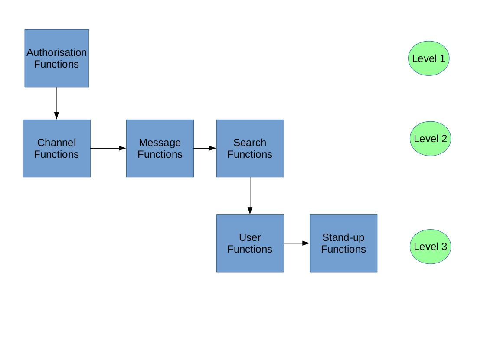

For the following iteration, a plan is derived to layout how tasks will be completed and which task are done before others. This allows the group to complete the project in a time efficient matter and to underline which operations are most important and which can wait. The way that the group determined the order which the functions are implemented is through there importance to solving the problem and which functions also depended the most on other functions. With this, the group will develop the Authorisation functions first due to there dependence on being able to send a message, create a channel or to search a particular message within a channel. After this the group will create the Channel, Message and Search functions as they are the base functions which the software operates on. Lastly, the group will implement the User and Stand-up functions as the group believes these are additional features to the software and not the main selling point. This layout is also evident in figure1 below; with level 1 being most important and the arrows demonstrate the order of implementation.

In terms of the time required to complete each function, the group have estimated that it should take at least two people, two hour to complete a function. This decision is a result from the groups discussion that if the functions are written by at least two people, they are able to have a better discussion about how the function should be written;  and whether the code they have written is the most optimal way of carrying out that particular function. Once a function has been written, the other group members should also examine that function to further validate its implementation. 